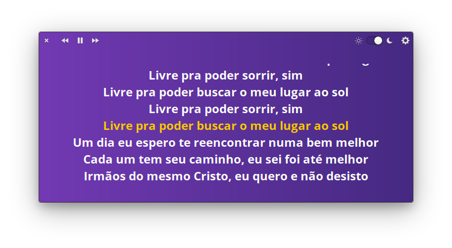
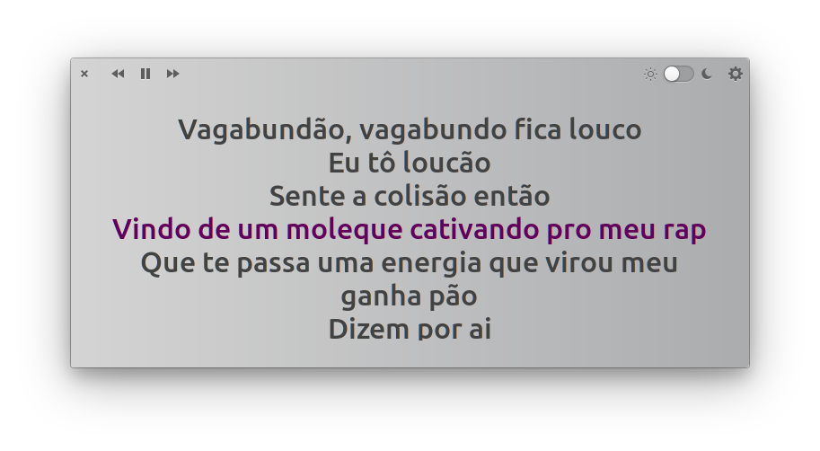
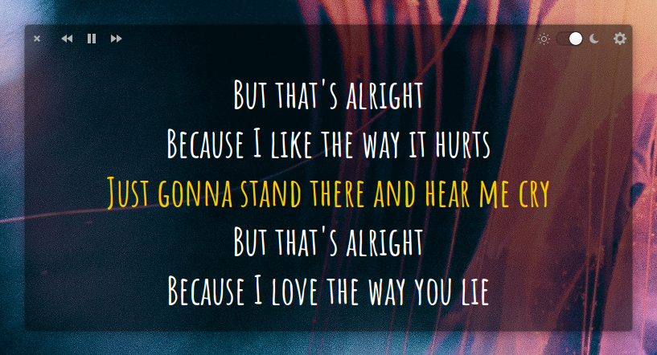

# Lyrics - Sing along with your songs
Display lyrics on media players with MPRIS-2 interface

    
    
    

|            |            |
| -------------------------------------------- | ------------------------------------------------- |

#### Using it with youtube
If you're using Chromium based browsers you can use lyrics on Youtube with this [browser-playerctl extension](https://chrome.google.com/webstore/detail/browser-playerctl/ojjjidifjmbbckdjfiagdfdepbcmnicg).

#### Known issue
Lyrics isn't able to syncronize with Spotify App (at least for free accounts) due to null MPRIS position, so the Lyrics will always start from beginnig wherever the track position is.

## Downloading lyrics

To enable the app to download lyrics you should install also [lyricsources](https://github.com/naaando/lyricsources), a python library adapted from [OSDLyrics](https://github.com/osdlyrics/osdlyrics)

## Building and Installation
You'll need the following dependencies:

    libglib2.0-dev
    libgranite-dev
    libgtk-3-dev
    libcairo2-dev
    meson
    valac

Run `meson` to configure the build environment and then `ninja` to build

    meson build --prefix=/usr
    ninja -C build

To install, use `ninja install`

    sudo ninja -C build install

And execute

  `com.github.naaando.lyrics`
